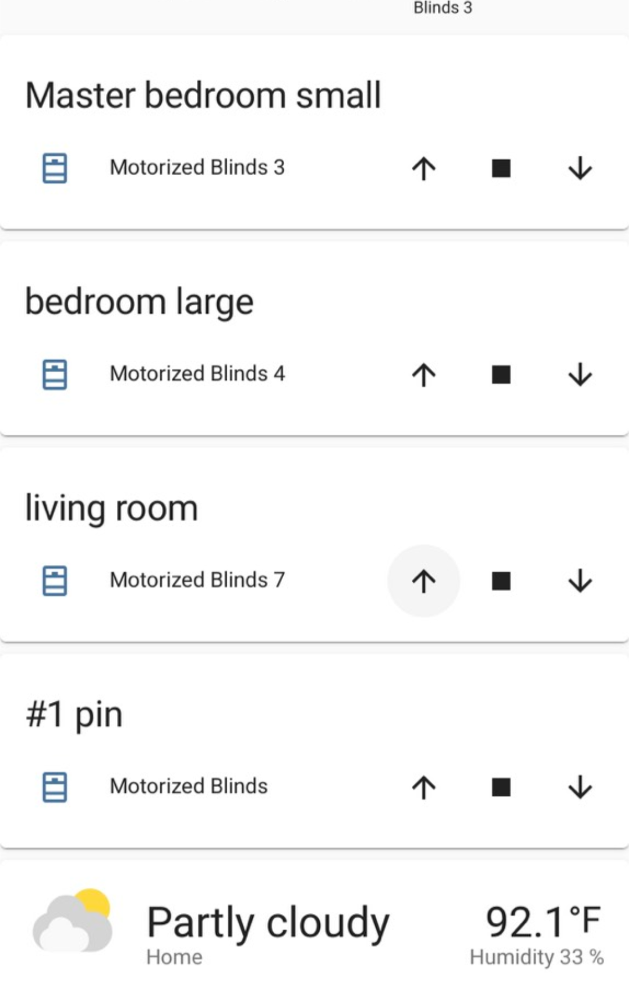
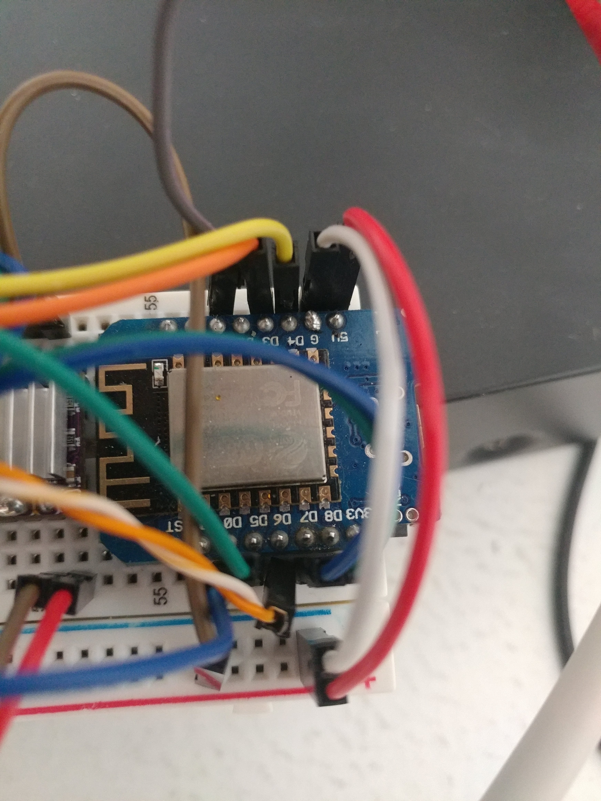
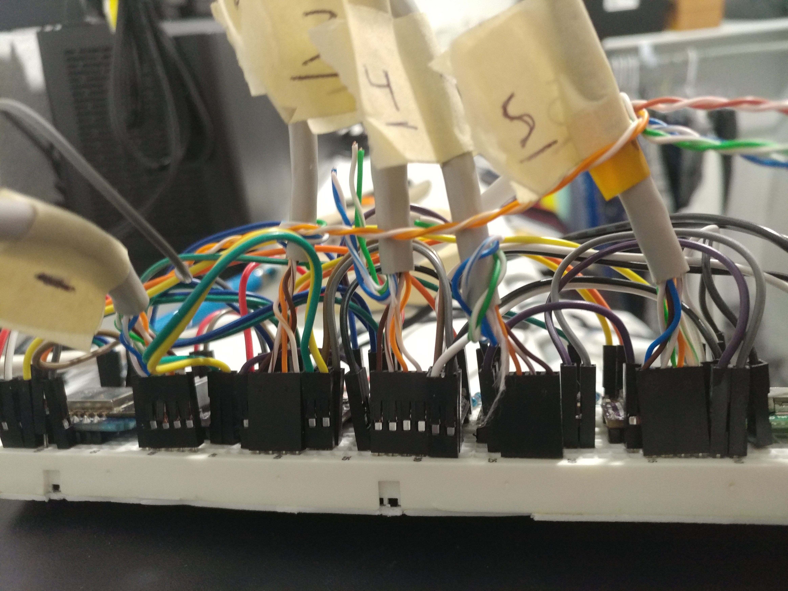
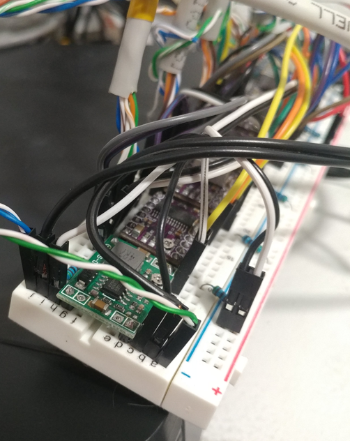

# Blinds-V2 - Amir Gorkovchenko (2022)

### !! Deprecated Version. See V3 !!

Blinds V1 was quickly replaced by V2.\
V2 is the refreshed version, redocumented, and fewer bugs.

This project works off of an MQTT server. The MQTT server we used was Home Assistant (back when it was free and local).

### Note
Core libraries and needed files can be found in Core branch

## Design
Stepper motors connect to an esp8266 board. Each Stepper motor is run to its respective blind via a cat cable.

The ESP8266 comes with WiFi 2.4Ghz capabilities making for an excellent all-in-on solution.

Through the homeassistant dashboard, each blind can be individually opened closed with status updates.

## Photos

homeassistant dashboard:

### Breadboard with esp8266, motor drivers and power supply:

